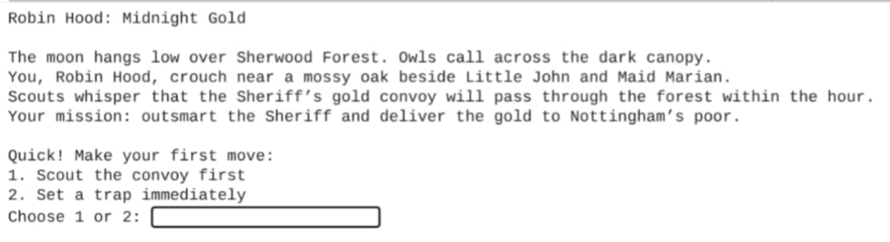

# Python-Robin-Hood

Robin Hood Python Teaching Text Game for Edexcel iGCSE Computer Science.

This project demonstrates key programming concepts such as loops, conditionals, functions, and user input/output. It is intended as a learning resource.

Features
- Multiple endings based on player choices
- Branching story logic

**Written as a Jupyter/Colab notebook.**

## Screenshot

## Code
- [code/RobinHoodMidnightGold.ipynb](code/RobinHoodMidnightGold.ipynb) – interactive notebook
- [code/RobinHoodMidnightGold.py](code/RobinHoodMidnightGold.py) – plain Python script
- [code/RobinHoodMidnightGold_TestEndings.py](code/RobinHoodMidnightGold_TestEndings.py) – plain Python script of automated tests for each story ending

## How to Open
- **On GitHub:**
- Click `Python-Robin-Hood.ipynb` to view directly.
  
- **In Google Colab:** 
  
- **Locally:** Download the file and open with Jupyter Notebook.

## Tests
To run all automated ending tests:
python -m unittest code/RobinHoodMidnightGold_TestEndings.py

## Documentation
- [docs/RobinHoodFlowchart.png](docs/RobinHoodFlowchart.png) – game logic flowchart  
- [docs/RobinHoodScript.md](docs/RobinHoodScript.md) – game script in detail
- [docs/RobinHoodEdexcelPseudocode.md](docs/RobinHoodEdexcelPseudocode.md) - Edexcel iGCSE Computer Science standard Pseudocode for the game
- [docs/ScreenshotRobinHoodGameplay1.jpg](docs/ScreenshotRobinHoodGameplay1.jpg) – gameplay screenshot (raw image)

## License
This project is licensed under the Apache License 2.0 – see the [LICENSE](LICENSE) file for details.

## Challenge
To create a simple, easy to understand text based game in Python that coveres the full development cycle to allow students to see how a game go from an idea to an implementation.
